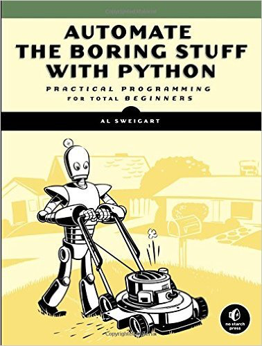

> ## Learning Objectives {.objectives}
>
> *   Explain what a for loop does.
> *   Correctly write for loops to repeat simple calculations.
> *   Trace changes to a loop variable as the loop runs.
> *   Trace changes to other variables as they are updated by a for loop.

Deep down, most people want to learn how to program so they can automate things.
To do that, we'll have to teach the computer how to repeat actions.

\

An example task that we might want to repeat is printing each character in a
word on a line of its own. One way to do this would be to use a series of `print` statements:

~~~ {.python}
word = 'lead'
print(word[0])
print(word[1])
print(word[2])
print(word[3])

~~~
~~~ {.output}
l
e
a
d
~~~

This is a bad approach for two reasons:

1.  It doesn't scale:
    if we want to print the characters in a string that's hundreds of letters long,
    we'd be better off just typing them in.

1.  It's fragile:
    if we give it a longer string,
    it only prints part of the data,
    and if we give it a shorter one,
    it produces an error because we're asking for characters that don't exist.

~~~ {.python}
word = 'tin'
print(word[0])
print(word[1])
print(word[2])
print(word[3])

~~~
~~~ {.output}
t
i
n
~~~
~~~ {.error}
---------------------------------------------------------------------------
IndexError                                Traceback (most recent call last)
<ipython-input-3-7974b6cdaf14> in <module>()
      3 print(word[1])
      4 print(word[2])
----> 5 print(word[3])

IndexError: string index out of range
~~~

Here's a better approach:

~~~ {.python}
word = 'lead'
for char in word:
    print(char)

~~~

~~~ {.output}
l
e
a
d
~~~

This is shorter---certainly shorter than something that prints every character in a hundred-letter string---and
more robust as well:

~~~ {.python}
word = 'oxygen'
for char in word:
    print(char)
~~~

~~~ {.output}
o
x
y
g
e
n
~~~

The improved version uses a [for loop](reference.html#for-loop)
to repeat an operation---in this case, printing---once for each thing in a collection.
The general form of a loop is:

~~~ {.python}
for variable in collection:
    do things with variable
~~~

We can call the [loop variable](reference.html#loop-variable) anything we like,
but there must be a colon at the end of the line starting the loop,
and we must indent anything we want to run inside the loop. Unlike many other languages, there is no
command to end a loop (e.g. end for); what is indented after the for statement belongs to the loop.

Here's another loop that repeatedly updates a variable:

~~~ {.python}
length = 0
for vowel in 'aeiou':
    length = length + 1
print('There are', length, 'vowels')
~~~

~~~ {.output}
There are 5 vowels
~~~

It's worth tracing the execution of this little program step by step.
Since there are five characters in `'aeiou'`,
the statement on line 3 will be executed five times.
The first time around,
`length` is zero (the value assigned to it on line 1)
and `vowel` is `'a'`.
The statement adds 1 to the old value of `length`,
producing 1,
and updates `length` to refer to that new value.
The next time around,
`vowel` is `'e'` and `length` is 1,
so `length` is updated to be 2.
After three more updates,
`length` is 5;
since there is nothing left in `'aeiou'` for Python to process,
the loop finishes
and the `print` statement on line 4 tells us our final answer.

Note that a loop variable is just a variable that's being used to record progress in a loop.
It still exists after the loop is over,
and we can re-use variables previously defined as loop variables as well:

~~~ {.python}
letter = 'z'
for letter in 'abc':
    print(letter)
print('after the loop, letter is', letter)
~~~

~~~ {.output}
a
b
c
after the loop, letter is c
~~~

Note also that finding the length of a string is such a common operation
that Python actually has a built-in function to do it called `len`:

~~~ {.python}
print(len('aeiou'))
~~~

~~~ {.output}
5
~~~

`len` is much faster than any function we could write ourselves,
and much easier to read than a two-line loop;
it will also give us the length of many other things that we haven't met yet,
so we should always use it when we can.

> ## From 1 to N {.challenge}
>
> Python has a built-in function called `range` that creates a sequence of numbers. Range can
> accept 1-3 parameters. If one parameter is input, range creates an array of that length,
> starting at zero and incrementing by 1. If 2 parameters are input, range starts at
> the first and ends at the second, incrementing by one. If range is passed 3 parameters,
> it stars at the first one, ends at the second one, and increments by the third one. For
> example,
> `range(3)` produces the numbers 0, 1, 2, while `range(2, 5)` produces 2, 3, 4,
> and `range(3, 10, 3)` produces 3, 6, 9.
> Using `range`,
> write a loop that uses `range` to print the first 3 natural numbers:
>
> ~~~ {.python}
> 1
> 2
> 3
> ~~~

> ## Computing powers with loops {.challenge}
>
> Exponentiation is built into Python:
>
> ~~~ {.python}
> print(5**3)
> 125
> ~~~
>
> Write a loop that calculates the same result as `5 ** 3` using
> multiplication (and without exponentiation).

> ## Reverse a string {.challenge}
>
> Write a loop that takes a string,
> and produces a new string with the characters in reverse order,
> so `'Newton'` becomes `'notweN'`.
