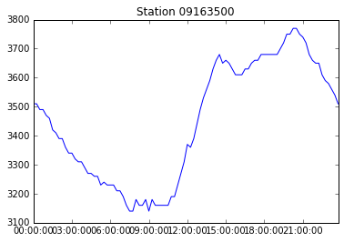
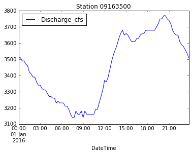
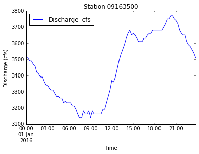

> ## Learning Objectives {.objectives}
>
> *   Use Pandas to import csv files.
> *   Access columns within DataFrames.
> *   Modify DataFrame column names and values.
> *   Slice DataFrames.
> *   Plot using Pandas and save plots to file.

At this point, this set of lessons diverges from the usual material included in the Software Carpentry novice Python lessons. The topics we cover are geared towards processing and analyzing scientific data, and handling the complexities that come with pulling data directly from real sources.

We would like to create a script that visualizes the streamgage data from the Colorado River over a specified period of time at different points along its course.

Traditionally, we would access the data through the [USGS website](http://waterwatch.usgs.gov/?m=real&r=az), clicking around, dowloading the file, and cleaning it up by hand. The csv file would look like this:

[http://waterdata.usgs.gov/az/nwis/uv?cb_00060=on&cb_00065=on&format=rdb&site_no=09380000&period=&begin_date=2016-01-01&end_date=2016-01-10](http://waterdata.usgs.gov/az/nwis/uv?cb_00060=on&cb_00065=on&format=rdb&site_no=09380000&period=&begin_date=2016-01-01&end_date=2016-01-10)

Instead of cleaning up these files this by hand, we are going to automate the entire process of data import and processing using Python. While manually extracting the data from one file would not take long, repeating the process frequently or with a large number of files would likely lead to errors.

Our code should:

* Take a list of USGS stations, a start date and an end date as input.
* Create plots of the gage height and discharge for each station on the list as output, and save them to individual files.

We will build this script by breaking it up into small tasks, gradually add complexity to our solution, and combine the pieces of code into a single program.

## Using Pandas for tabular data

In a previous lesson we used a Python library called NumPy to handle arrays of data. NumPy arrays are perfect for doing calculations with our data, but they can only handle floats or integers. Tabular data more closely resembles spreadsheets, where entries such as dates and times are in some useful format.

One of the best options for working with tabular data in Python is the Python Data Analysis Library (a.k.a. Pandas). The Pandas library provides its own set of data structures, produces high quality plots through Matplotlib (the plotting library we used earlier), and integrates nicely with other libraries that can use NumPy arrays.

Let's start by importing streamgage data from a file that has already been partially cleaned up. Compare the URL in the introduction with the file we provided: we removed the file header and the column format line ("5d 15s..."), and saved the file as a comma-delimited file instead of tab delimited.

First, we import the Pandas library and give it the shortcut `pd`. We can use the Pandas function `read_csv` to import the file and assign them to a variable named `data`. This will pull the contents of the file into a DataFrame. We can then print the first 5 lines of the DataFrame using the method `head()`:

~~~ {.python}
import pandas as pd

data = pd.read_csv('data/streamgage.csv')
data.head()
~~~

> ## What's a DataFrame? {.callout}
> 
> A DataFrame is a 2-dimensional data structure that can store data of different types (including characters, integers, floating point values, factors and more) in columns. It is similar to a spreadsheet or an SQL table or the data.frame in R.
> 
> Check the data type of `data` using the `type` method. The `type` method and `__class__` attribute tell us what type of object the variable points to. We will not discuss the full meaning of this terminology, related to object-oriented programming, in the workshop.
> 
> ~~~ {.python}
> print type(data)
> print data.__class__
> ~~~
> ~~~ {.output}
> <class 'pandas.core.frame.DataFrame'>
> <class 'pandas.core.frame.DataFrame'>
> ~~~

Each column in a DataFrame also has a type. We can use `data.dtypes` to view the data type for each column. `int64` represents numeric integer values - `int64` cells can not store decimals. `object` represents strings (letters and numbers). `float64` represents numbers with decimals.

~~~ {.python}
data.dtypes
~~~
~~~ {.output}
agency_cd       object
site_no          int64
datetime        object
tz_cd           object
01_00060         int64
01_00060_cd     object
02_00065       float64
02_00065_cd     object
dtype: object
~~~

We need to give the DataFrame column names that are easier to read. Let's create a list with the column names we want:

~~~ {.python}
new_column_names = ['Agency', 'Station', 'OldDateTime', 'Timezone', 'Discharge_cfs', 'Discharge_stat', 'Stage_ft', 'Stage_stat']
~~~

We can see the column names of a DataFrame using the method `columns`, and we can use that same method to give the DataFrame the new column names:

~~~ {.python}
print 'Old column names:', data.columns

data.columns = new_column_names

print 'New column names:', data.columns
~~~
~~~ {.output}
Old column names: Index([u'agency_cd', u'site_no', u'datetime', u'tz_cd', u'01_00060',
       u'01_00060_cd', u'02_00065', u'02_00065_cd'],
      dtype='object')
New column names: Index([u'Agency', u'Station', u'OldDateTime', u'Timezone', u'Discharge_cfs',
       u'Discharge_stat', u'Stage_ft', u'Stage_stat'],
      dtype='object')
~~~

The values in each column of a Pandas DataFrame can be accessed using the column name. If we want to access more than one column at once, we use a list of column names:

~~~ {.python}
data[['Discharge_cfs','Stage_ft']].head()
~~~

We can also create new columns using this syntax:

~~~ {.python}
data['Stage_m'] = data['Stage_ft'] * 0.3048
~~~

### Fixing the station name

When Pandas imported the data, it read the station name as an integer and removed the initial zero. We can fix the station name by replacing the values of that column with a string.

Remember that we are doing all of this so we can later automate the process for multiple stations. Instead of writing the correct station name ourselves, let's build it from the values available in the DataFrame:

~~~ {.python}
data['Station'].unique()
~~~
~~~ {.output}
array([9163500])
~~~

The Pandas method `unique` returns a NumPy array of the unique elements in the Stations column of the DataFrame. We want the first (and only) entry to that array, which has the index 0. We can build a string with the correct station name by **casting** the integer as a string and concatenating it with an initial zero (also as a string):

~~~ {.python}
new_station_name = "0" + str(data['Station'].unique()[0])
print new_station_name
~~~
~~~ {.output}
09163500
~~~

We can replace all values in the 'Station' column with this string through assignment, and we can check the object type of each column to make sure it is no longer an integer:

~~~ {.python}
data['Station'] = new_station_name
data.dtypes
~~~
~~~ {.output}
Agency             object
Station            object
OldDateTime        object
Timezone           object
Discharge_cfs       int64
Discharge_stat     object
Stage_ft          float64
Stage_stat         object
Stage_m           float64
dtype: object
~~~

### Handling date and time stamps

Different programming languages and software packages handle date and time stamps in their own unique and obscure ways. Pandas has a set of functions for creating and managing timeseries that is well described in the documentation.

We need to convert the entries in the DateTime column into a format that Pandas recognizes. Luckily, the `to_datetime` function in the Pandas library can convert it directly:

~~~ {.python}
data['DateTime'] = pd.to_datetime(data['OldDateTime'])
~~~

### Subsetting data and removing columns

The entries in our DataFrame `data` are indexed by the number in **bold** on the left side of the row. We can display a slice of the data using index ranges just as we did with NumPy arrays:

~~~ {.python}
data[0:4]
~~~

> ## `loc` or `iloc`? {.callout}
> 
> Accessing individual rows or subsets of both rows and columns in Pandas is a bit more complicated. We can select specific ranges of our data in both the row and column directions using either label or integer-based indexing.
> 
> - `loc`: indexing via labels or integers
> - `iloc`: indexing via integers
> 
> To select a subset of rows AND columns from our DataFrame, we can use the `iloc` method and the integer indices for both rows and columns:
> 
> 
> ~~~ {.python}
> data.iloc[0:2,-2:]
> ~~~
>
> Or the `loc` method, using integer indices for rows and labels for columns:
> 
> ~~~ {.python}
> data.loc[0:2, ['DateTime', 'Stage_m']]
> ~~~
> 
> The number of rows that these two commands return is different! The method `iloc` behaves like indexing in other sequences in Python, ignoring the end bound. With `loc`, however, the start and end bounds of the row indices are included. Compare them using the `shape` method:
> 
> ~~~ {.python}
> print 'With iloc:', data.iloc[0:2,-2:].shape
> print 'With loc:', data.loc[0:2, ['DateTime', 'Stage_m']].shape
> ~~~
> ~~~ {.output}
> With iloc: (2, 2)
> With loc: (3, 2)
> ~~~

Since we can call individual columns (or lists of columns) from a DataFrame, the simplest way to remove columns is by creating new DataFrames with only the columns we want:

~~~ {.python}
clean_data = data[['Station', 'DateTime', 'Discharge_cfs', 'Stage_ft']]
~~~

### Plotting stage and discharge

Pandas is well integrated with the Matplotlib library that we used ealier to create plots. We can use the same functions we used before with NumPy arrays or we can use the plotting functions built into Pandas:

~~~ {.python}
import matplotlib.pyplot as plt
%matplotlib inline

plt.plot(data['DateTime'], data['Discharge_cfs'])
plt.title('Station ' + data['Station'][0])
~~~
~~~ {.output}
<matplotlib.text.Text at 0x10a6884d0>

~~~

~~~ {.python}
data.plot(x='DateTime', y='Discharge_cfs', title='Station ' + data['Station'][0])
~~~
~~~ {.output}
<matplotlib.axes._subplots.AxesSubplot at 0x109eec810>

~~~

We can use `pyplot` methods to customize the Pandas plot and save the figure:

~~~ {.python}
data.plot(x='DateTime', y='Discharge_cfs', title='Station ' + data['Station'][0])
plt.xlabel('Time')
plt.ylabel('Discharge (cfs)')
plt.show()
plt.savefig('data/discharge_' + data['Station'][0] + '.png')
~~~
~~~ {.output}

<matplotlib.figure.Figure at 0x10b205890>
~~~

### Putting it all together

Let's go back through the code we've written and put together the commands we need to import data and make a plot of discharge:

~~~ {.python}
import pandas as pd
import matplotlib.pyplot as plt
%matplotlib inline

data = pd.read_csv('data/streamgage.csv')

new_column_names = ['Agency', 'Station', 'OldDateTime', 'Timezone', 'Discharge_cfs', 'Discharge_stat', 'Stage_ft', 'Stage_stat']
data.columns = new_column_names

data['DateTime'] = pd.to_datetime(data['OldDateTime'])

new_station_name = "0" + str(data['Station'].unique()[0])
data['Station'] = new_station_name

data.plot(x='DateTime', y='Discharge_cfs', title='Station ' + new_station_name)
plt.xlabel('Time')
plt.ylabel('Discharge (cfs)')
plt.savefig('data/discharge_' + new_station_name + '.png')
plt.show()
~~~
~~~ {.output}

~~~